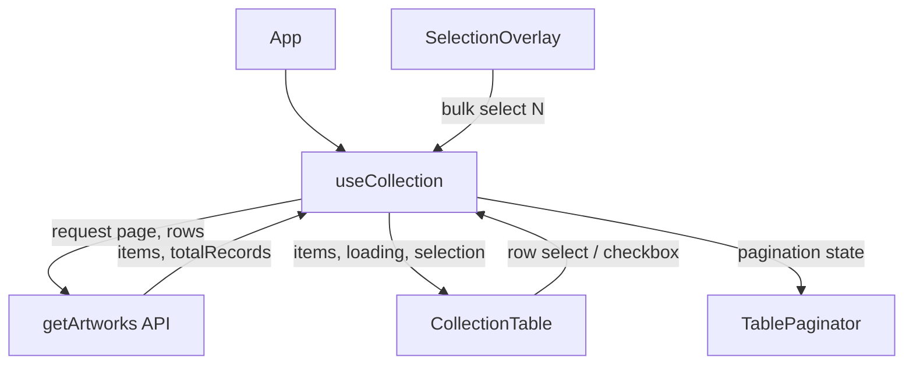

# Collection Table

A modular, type-safe data table with advanced selection UX, built using **Vite + React + TypeScript + PrimeReact**.  
Focus: clean architecture, reusable hooks/components, scalable patterns.

---

# TODO
- [x] Project Setup (TypeScript + Vite + React + TailwindCSS + PrimeReact)
- [x] PrimeReact DataTable
- [x] **SSR** Pagination
- [x] Row Selection
- [x] **Persistent** Selection
- [x] Deploy on Netlify
- [] Across Pages Row Selection

### Stretch Goals
- [] Introduce Themes with corresponding Light/Dark Mode

---

## ✨ Features

- Server-side pagination
- Row selection (checkbox / row-click toggle)
- “Select N rows” overlay in header
- Persistent selection state
- Skeleton loading state (no layout shift)
- Fully typed (TypeScript)
- Headless data logic via custom hook

---

## 🧠 Architecture Overview

- **State + data fetching** live in a single hook (`useCollection`)
- **UI components** are dumb/presentational
- **Pagination** handled outside `DataTable`
- **Selection logic** centralized, reusable

---

## 📁 Folder Structure

```
src/
├── App.tsx 
├── components/
│ ├── CollectionTable.tsx # DataTable wrapper
│ ├── CollectionTableSkeleton.tsx
│ ├── SelectionOverlay.tsx # Header dropdown (select N)
│ └── TablePaginator.tsx # External paginator
├── hooks/
│ └── useCollection.ts # Data + selection logic
├── lib/
│ └── api.ts # API client
├── types/
│ └── artworks.ts # Domain types
└── App.css
```

---

## 🔁 Data Flow (Mermaid)



#Getting Started
```bash
npm install
npm run dev

```


