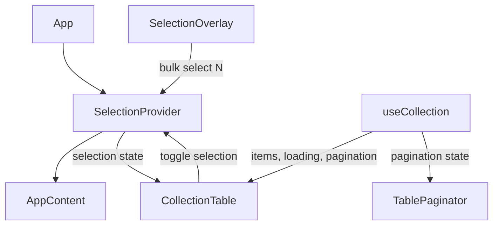

<div align="center">

# Collection Table

A modular, stress-tested, type-safe data table with advanced selection UX, built using **Vite + React + TypeScript + PrimeReact**.

</div>

---

## Demo

Video demo: [data-table-demo.mp4](./public/data-table-demo.mp4)


---

## Features

- Server-side pagination
- Row selection (manual + bulk modes)
- "Select N rows" overlay
- Persistent selection across pages
- Skeleton loading state
- Fully typed (TypeScript)
- Context-based state management
- PrimeReact DataTable integration

---

## Architecture

- **SelectionContext** manages row selection state (manual + bulk modes)
- **useSelection()** hook provides access to selection state
- **useCollection** hook manages pagination, loading, and data fetching
- UI components are dumb/presentational
- PrimeReact DataTable wrapped with custom selection logic

---

## Folder Structure
```
src/
├── App.tsx
├── components/
│   ├── CollectionTable.tsx        # DataTable wrapper with selection
│   ├── CollectionTableSkeleton.tsx
│   ├── SelectionOverlay.tsx       # Bulk select dropdown
│   └── TablePaginator.tsx         # External paginator
├── context/
│   └── SelectionContext.tsx       # Selection state (manual + bulk)
├── hooks/
│   ├── useCollection.ts           # Data + pagination hook
│   └── useSelection.ts            # Selection hook
├── lib/
│   └── api.ts
├── types/
│   └── artworks.ts
└── App.css
```
---

## Data Flow



---

## TODO

- [x] Project Setup (TypeScript + Vite + React + TailwindCSS + PrimeReact)
- [x] PrimeReact DataTable
- [x] SSR Pagination
- [x] Row Selection
- [x] Persistent Selection across pages
- [x] Bulk Row Selection via PrimeReact Overlay 
- [x] Across Pages Row Selection
- [ ] Themes with Light/Dark Mode

---

## Getting Started

```bash
npm install
npm run dev
```
